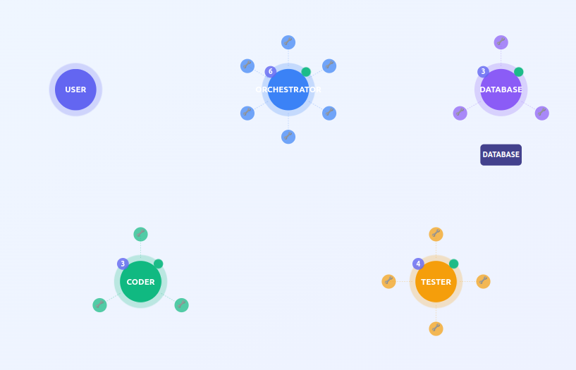

# Multi-Agent Orchestration System

A multi-agent system powered by Haystack AI that coordinates specialized agents to handle complex coding and research tasks.



## Agents

- **Orchestrator**: Plans workflows and coordinates other agents
- **Coder**: Implements code and fixes issues
- **Tester**: Writes and runs unit tests
- **Database**: Manages Neo4j knowledge graph operations <span style="color:red">Neo4j integration not done yet.</span>
- **Research**: Performs web searches and gathers information

## Quick Setup

### Prerequisites
- Python 3.8+ (3.12 was used for demo)
- Node.js 16+
- OpenAI API key
- (Optional) SerperDev API key for web search

### Installation

```bash
# Backend
pip install -r requirements.txt

# Frontend
cd frontend && npm install && cd ..
```

### Configure API Keys

Create a `.env` file in the project root:
```bash
OPENAI_API_KEY=your-openai-key
SERPERDEV_API_KEY=your-serperdev-key  # Optional, for research agent
```

## Running

```bash
# Start both backend and frontend
python start_system.py

# Or manually:
# Terminal 1: python real_agent_bridge.py
# Terminal 2: cd frontend && npm run dev
```

Access at: **http://localhost:5173**

## Usage

1. Enter your request in the prompt
2. Watch agents collaborate in real-time
3. Monitor tasks and orchestrator updates
4. Review generated files at the bottom

## Features

- **Real-time Visualization**: Agent network with live message flow
- **Task Tracking**: See workflow progress and orchestrator updates
- **Web Search**: Research agent can gather information from the web
- **Tool Usage**: Agents use specialized tools (file ops, testing, database, web search)
- **Reset Button**: Clear workspace and restart system
